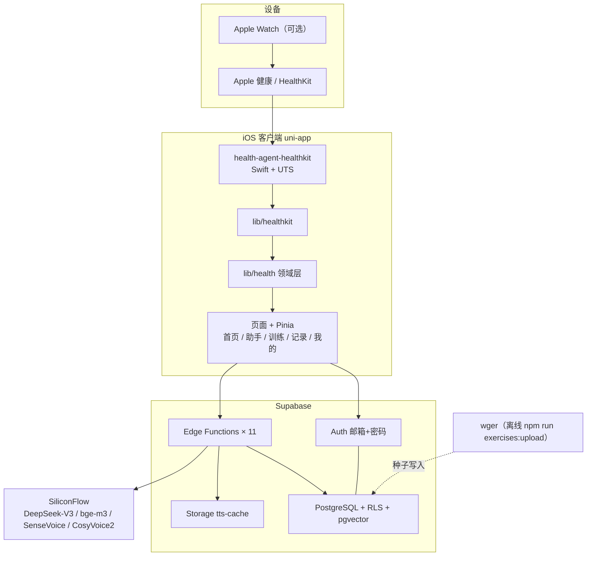
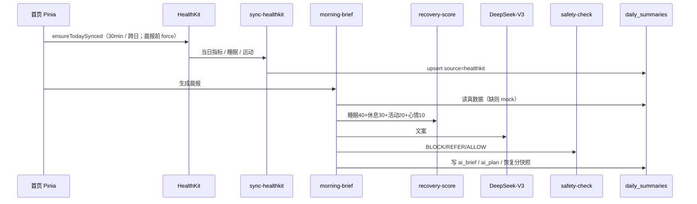

# Health On Palm 系统拓扑与数据模型

对照现行仓库（约 0.3.8）：iOS uni-app + Supabase + SiliconFlow。  
交互版见 Cursor Canvas（聊天旁打开）：`hop-architecture.canvas.tsx`。

不读 HealthKit 病历 / 化验 / 用药 / 经期 / 饮食。不做 Background Delivery。微信支付与定时推送未做。

---

## 1. 系统拓扑



H5 / 小程序读不到 HealthKit：适配层 `available=false`，晨报回退 Mock。  
底部五 Tab 现用 `uni.redirectTo`，尚未改 native `tabBar` + `switchTab`。

### Edge Functions

| 函数 | 职责 |
|------|------|
| `morning-brief` | 晨报：真数据 + 恢复分 + LLM + 安全闸 |
| `recovery-score` | 恢复分（睡眠 40 + 休息 30 + 活动 20 + 心情 10） |
| `workout-agent` | 从 `exercises.is_featured` 选动作，写入 `ai_plan` |
| `query-agent` | 助手问答 |
| `safety-check` | 规则 + 可选 LLM：BLOCK / REFER / ALLOW |
| `memory-working` | L1：当日 `conversations`（12 轮摘要 / 20 条截断） |
| `memory-episodic` | L2：`health_memories` + bge-m3 |
| `sync-healthkit` | upsert 摘要 / 睡眠 / 运动 + `sync_logs` |
| `mock-health-data` | 无 HealthKit 时的假数据 |
| `speech-to-text` | SenseVoice |
| `text-to-speech` | CosyVoice2 → `tts-cache` |

---

## 2. 数据模型（ER）

```mermaid
erDiagram
  AUTH_USERS ||--|| USERS : "id 1:1 CASCADE"
  USERS ||--o{ DAILY_SUMMARIES : "UNIQUE user_id+date"
  USERS ||--o{ SLEEP_LOGS : "UNIQUE user_id+date"
  USERS ||--o{ MOOD_LOGS : "UNIQUE user_id+date"
  USERS ||--o{ WORKOUT_LOGS : "UNIQUE user_id+workout_id"
  USERS ||--o{ CONVERSATIONS : "按日读写 无 UNIQUE"
  USERS ||--o{ HEALTH_MEMORIES : "VECTOR 1024"
  USERS ||--o{ SYNC_LOGS : "履历"
  USERS ||--o{ TOKEN_USAGE_LOGS : "可空 user_id"
  EXERCISES ||--o{ WORKOUT_LOGS : "exercise_ids UUID[]"

  AUTH_USERS {
    uuid id PK
  }

  USERS {
    uuid id PK_FK
    text nickname
    int age
    text gender
    numeric height_cm
    numeric weight_kg
    numeric sleep_goal_hours
    text fitness_level
    text preferred_workout_time
    bool onboarding_completed
    text subscription_tier
  }

  DAILY_SUMMARIES {
    uuid id PK
    uuid user_id FK
    date date
    int steps
    numeric active_calories
    numeric basal_calories
    numeric stand_hours
    int exercise_minutes
    int resting_heart_rate
    int hrv_ms
    numeric spo2_percent
    numeric vo2_max
    text source
    text ai_brief
    jsonb ai_plan
    numeric ai_recovery_score
    text ai_workout_readiness
  }

  SLEEP_LOGS {
    uuid id PK
    uuid user_id FK
    date date
    numeric total_sleep_hours
    numeric deep_sleep_hours
    numeric light_sleep_hours
    numeric rem_sleep_hours
    int wake_ups
    text source
  }

  WORKOUT_LOGS {
    uuid id PK
    uuid user_id FK
    date date
    text workout_id
    text workout_type
    int duration_minutes
    text source
    uuid_arr exercise_ids
  }

  MOOD_LOGS {
    uuid id PK
    uuid user_id FK
    date date
    text mood
    text note
  }

  EXERCISES {
    uuid id PK
    text slug UK
    int wger_id UK
    text name_zh
    text movement_phase
    text intensity
    bool is_featured
  }

  CONVERSATIONS {
    uuid id PK
    uuid user_id FK
    date date
    jsonb messages
    text context_summary
  }

  HEALTH_MEMORIES {
    uuid id PK
    uuid user_id FK
    text memory_type
    text content
    vector content_embedding
  }

  SYNC_LOGS {
    uuid id PK
    uuid user_id FK
    date sync_date
    text status
    int record_count
  }

  TOKEN_USAGE_LOGS {
    uuid id PK
    uuid user_id FK
    text model
    int tokens_in
    int tokens_out
    numeric cost
  }
```

`public.users.id` = `auth.users.id`。注册后由 Dashboard 触发器 `handle_new_user()` 建档（不在 migrations）。  
除 `exercises`（登录可读、写入仅 service role）外，用户表 RLS：`user_id = auth.uid()`。

`health_memories.content_embedding`：W1 建表为 `VECTOR(1536)`，切 bge-m3 后 ALTER 为 **1024**。

---

## 3. 关键数据流

### 晨报



恢复分结果写入 `daily_summaries.ai_recovery_score`，是快照不是实时视图。缺睡眠按 32/40 计；休息维看连续训练与近 7 日 `workout_logs`。

### HealthKit 写入策略

| 目标表 | 策略 | source |
|--------|------|--------|
| `daily_summaries` | `ON CONFLICT (user_id, date)` upsert | `healthkit` |
| `sleep_logs` | 有时长才 upsert，整日覆盖 | `healthkit_sync` |
| `workout_logs` | `(user_id, workout_id)` 去重插入；手填 `workout_id` 可空 | `healthkit_sync` |
| `sync_logs` | 追加履历 | `healthkit` |

活动：当地日 00:00 至今。睡眠：今日 12:00 往前 18 小时（窗口归属「昨日 18:00–今日 12:00」）。缺 date 时 Edge 用 `Asia/Shanghai`。

### 训练计划

`workout-agent` 只从约 160 条 `is_featured` 选 id，禁止编造。闸门：恢复分 &lt; 50 或 readiness=`rest` 时仅 light / 热身 / 拉伸。结构：热身 1–2 + 正式 3–5 + 拉伸 1–2。不写重量组数。打卡：`workout_logs.source=ai_suggested` + `exercise_ids`。

### 助手

输入先 `safety-check` → `query-agent` 注入档案与摘要 → `memory-working` 读写当日对话 → 需要时 `memory-episodic` + bge-m3。输出再过 Safety。语音：SenseVoice / CosyVoice2。
