# Health On Palm（HOP）使用说明书

> **产品名称**：Health On Palm（掌上健康 / HOP）  
> **文档版本**：v1.1  
> **更新日期**：2026-08-20  
> **适用客户端**：iOS App（iPhone，建议 iOS 14+）  
> **读者对象**：种子用户、内测体验者、运营协助人员  
> **相对 v1.0**：五 Tab 导航、今日训练计划、心情记录、恢复分规则更新、HealthKit 半小时自动同步与晨报前强制同步  

---

## 阅读说明

1. **本文依据当前 App 真实界面文案与交互编写**，覆盖注册登录、引导、HealthKit、首页晨报、HOP 助手（含语音）、今日训练计划、运动/心情/睡眠记录、档案设置等全部主要流程。  
2. 文中配图为**界面示意图**（便于阅读理解），实际真机界面可能因系统字体、机型尺寸略有差异，**以真机显示为准**。  
3. HOP 提供的是**一般性健康与生活方式建议**，**不构成医疗诊断、处方或治疗方案**。若有持续不适、异常指标或紧急症状，请及时就医。  
4. 配图目录：`doc/manual-assets/`。

### 本版相对 v1.0 的主要变化（先看这里）

| 变化 | 说明 |
|------|------|
| 底部导航 | 由 3 个 Tab 扩展为 **5 个**：首页 · 助手 · 训练 · 记录 · 我的 |
| 今日训练计划 | 新增「训练」Tab：按恢复分从精选动作库生成计划，可打卡 |
| 心情记录 | 「记录」中可每日记录心情，并计入恢复分（心情维度约 10%） |
| 运动类型 | 手动记录运动类型大幅扩展（有氧/力量柔韧/球类等） |
| HealthKit 同步 | **约每 30 分钟**（或跨日后）进入首页会自动同步；生成晨报前会先拉最新数据 |
| 恢复分 | 无真实睡眠时给中性分并提示「睡眠数据缺失」；休息平衡与心情规则已调整 |
| 首页体验 | Tab 切回更快；跨日会自动丢掉昨日缓存，避免今早仍显示昨天数据 |

### 配图索引

| 编号 | 文件 | 对应章节 |
|------|------|----------|
| 图1 | `manual-assets/01-login.png` | 注册与登录 |
| 图2 | `manual-assets/07-onboarding.png` | 新手引导 |
| 图3 | `manual-assets/04-healthkit.png` | HealthKit 授权 |
| 图4 | `manual-assets/02-home-v11.png` | 首页与晨报（五 Tab） |
| 图5 | `manual-assets/03-chat.png` | HOP 助手 |
| 图6 | `manual-assets/10-voice-hold.png` | 语音输入 |
| 图7 | `manual-assets/11-workout-plan.png` | 今日训练计划 |
| 图8 | `manual-assets/05-records-v11.png` | 健康记录入口 |
| 图9 | `manual-assets/08-workout-log.png` | 记录运动 |
| 图10 | `manual-assets/12-mood-log.png` | 记录心情 |
| 图11 | `manual-assets/09-sleep-log.png` | 记录睡眠 |
| 图12 | `manual-assets/06-profile.png` | 我的档案 |

---

## 一、开始之前

### 1.1 你需要准备什么

| 项目 | 要求 |
|------|------|
| 设备 | **iPhone**（iOS 14 及以上更稳妥） |
| 网络 | 稳定的 Wi‑Fi 或蜂窝网络（登录、晨报、问答、训练计划、语音均需联网） |
| Apple ID | 用于 TestFlight 安装（若由组织者通过 TestFlight 分发） |
| 邮箱 | 一个常用邮箱，用于**注册 / 登录**（不再使用手机短信验证码） |
| 「健康」App | 系统自带；建议已有步数、睡眠等历史数据，体验更完整 |
| 麦克风 | 使用语音输入时需允许麦克风权限 |

### 1.2 如何安装 App（远程用户推荐）

当前种子内测推荐使用 **TestFlight**：

1. 打开组织者发来的 **TestFlight 邀请链接 / 邮件**。  
2. 若尚未安装，先在 App Store 安装免费应用 **TestFlight**。  
3. 在 TestFlight 中接受邀请，安装 **Health On Palm**。  
4. 打开 App，进入登录页。  

> **说明**：本产品的 HealthKit、录音等能力依赖 **iOS 原生 App**。微信小程序或纯浏览器 H5 **无法**完整体验。

### 1.3 首次打开可能看到的系统弹窗

| 弹窗类型 | 建议操作 | 用途 |
|----------|----------|------|
| 网络相关 | 允许 | 登录与云端服务 |
| 麦克风 | 需要语音时选择「允许」 | 按住说话转文字 |
| 「健康」数据访问 | 按指引允许相关类别 | 同步步数、睡眠、心率等 |

拒绝麦克风仍可打字提问；拒绝健康授权仍可使用手动记录与部分参考数据，但个性化程度会下降。

---

## 二、注册与登录

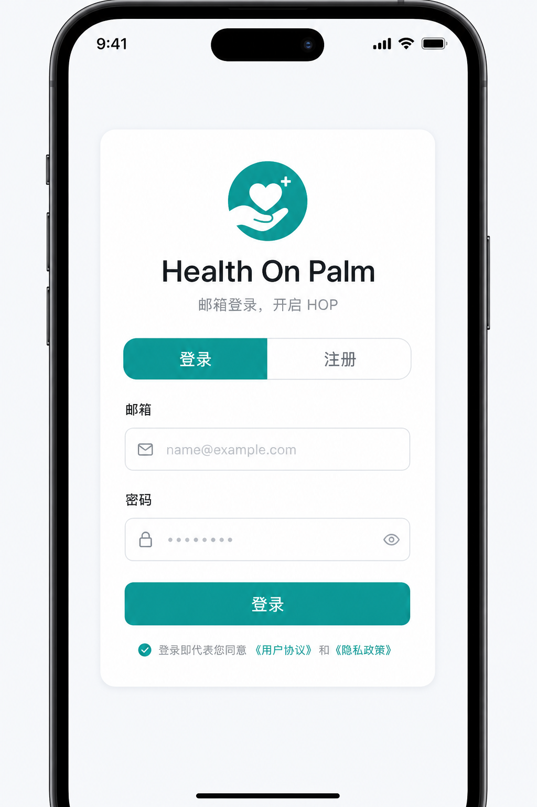

*图1 登录 / 注册页示意*

### 2.1 界面认识

| 区域 | 说明 |
|------|------|
| 顶部品牌 | 显示「Health On Palm」与副标题 |
| 「登录 / 注册」切换 | 顶部选项卡，或底部「去注册 / 去登录」文字链接 |
| 邮箱 | 输入框，占位提示示例 `name@example.com` |
| 密码 | 密码输入（至少 6 位）；注册时还有「确认密码」 |
| 主按钮 | 登录模式下为「登录」；注册模式下为「注册并登录」 |
| 页脚 | 「登录即表示同意《用户协议》与《隐私政策》」（当前为占位，点击会提示开发中） |

登录模式副标题：**邮箱登录，开启 HOP**  
注册模式副标题：**注册账号，开启 HOP**

### 2.2 新用户：注册

1. 打开 App，进入登录页。  
2. 点击顶部 **「注册」**，或点击底部 **「去注册」**。  
3. 在「邮箱」中输入有效邮箱（建议使用真实常用邮箱）。  
4. 在「密码」中设置密码：**不少于 6 位**（建议包含字母与数字，勿使用过于简单的密码）。  
5. 在「确认密码」中再次输入相同密码。  
6. 点击 **「注册并登录」**。  
7. 出现「注册中...」加载提示；成功后提示 **「注册成功」**，并自动进入下一步路由（新手引导或授权页或首页）。

**注册失败常见原因：**

| 提示含义 | 你可以怎么做 |
|----------|----------------|
| 请输入有效邮箱 | 检查是否有空格、是否缺少 `@` |
| 密码至少 6 位 | 加长密码 |
| 两次密码不一致 | 确认两次输入完全相同 |
| 该邮箱已注册 | 切换到「登录」直接登录 |
| 需要邮箱确认 | 联系组织者：内测环境应在 Supabase 关闭 Confirm email |

### 2.3 老用户：登录

1. 确保处于 **「登录」** 选项卡。  
2. 输入注册时使用的邮箱与密码。  
3. 点击 **「登录」**。  
4. 成功后提示 **「登录成功」**，并进入你上次进度对应的页面。

### 2.4 自动保持登录

App 会在本地保存会话。下次打开时，若令牌仍有效或可自动刷新，通常**无需重新输入密码**。若提示「登录已过期，请重新登录」，按提示回到登录页重新登录即可。

### 2.5 约束一览（登录）

| 项目 | 规则 |
|------|------|
| 邮箱长度 | 最长约 254 字符 |
| 密码长度 | 至少 6 位，输入上限约 72 位 |
| 网络 | 必须联网 |

---

## 三、新手引导（仅首次）

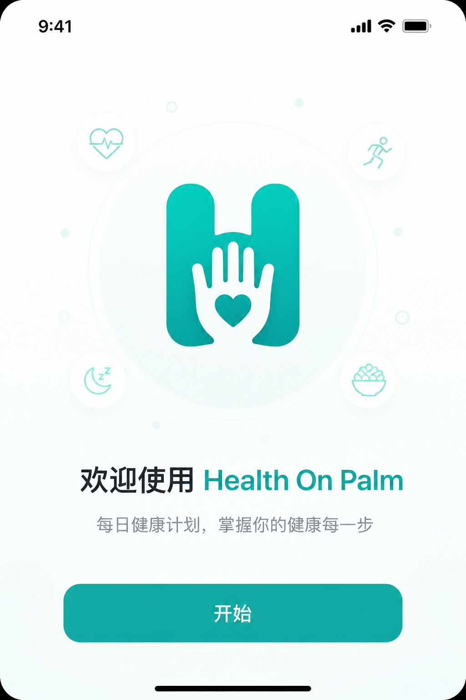

*图2 新手引导欢迎页示意*

首次注册成功的用户会进入多步骤引导。请按屏幕提示完成，**不要强行杀进程**，否则可能需重新进入。

### 3.1 步骤一：欢迎

- 标题：**欢迎使用 Health On Palm**  
- 说明：每天根据你的身体状态，自动规划下一步行动  
- 点击 **「开始」** 进入下一步  

### 3.2 步骤二：填写健康档案

- 标题：**填写健康档案**  
- 填写项：  
  - **年龄**：从列表选择（可选范围约 **18–80** 岁）  
  - **身高 (cm)**：有效范围约 **100–250**  
  - **体重 (kg)**：有效范围约 **30–200**  
- 点击 **「下一步」**；可点 **「‹ 上一步」** 返回  

未填或超出范围时，会提示如「请选择年龄」「请填写有效身高…」等。

### 3.3 步骤三：运动偏好

- 标题：**运动偏好**  
- **运动水平**：初级 / 中级 / 高级（必选其一）  
- **偏好训练时间**：早晨 / 中午 / 晚上 / 灵活（必选其一）  
- 点击 **「下一步」**  

### 3.4 步骤四：健康数据授权说明

本步是**说明与意向选择**，真正的系统授权在后续「健康数据授权」页完成。

- 说明会列出：步数与活动、睡眠、训练记录等用途  
- 按钮：  
  - **「继续」**：进入完成步骤（随后可能进入正式授权页）  
  - **「稍后授权」**：也可进入下一步，之后可在「我的 → 数据同步」再授权  

### 3.5 步骤五：完成并保存

- 进入本步时，App 可能**自动保存**档案（提示「正在保存你的档案…」）  
- 保存成功后显示 **「准备就绪」**  
- 点击 **「进入首页」**  

默认昵称规则（若你未另设昵称）：优先使用**邮箱 @ 前面的部分**（最长约 20 字）。

保存失败时会提示重试；请保持网络畅通后再次点击进入。

---

## 四、连接 Apple 健康（HealthKit）

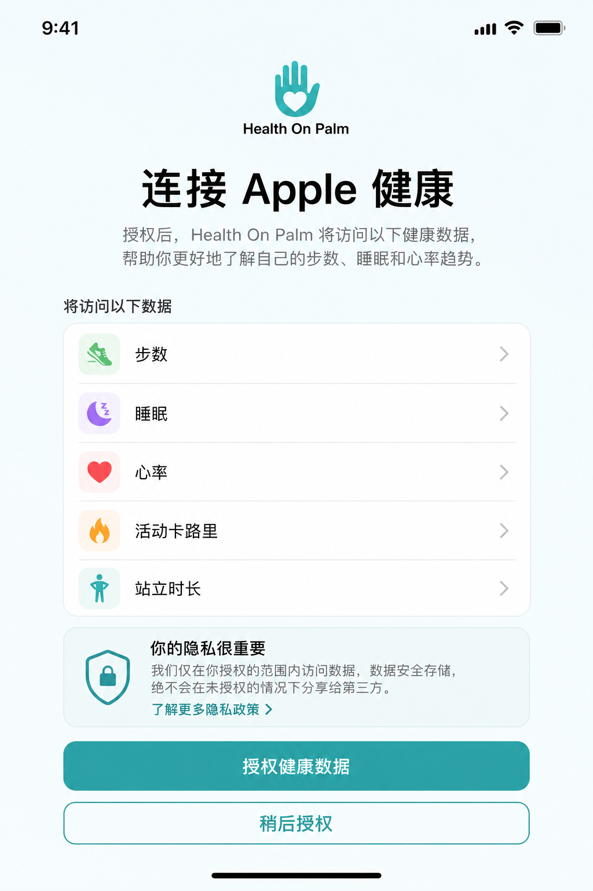

*图3 HealthKit 授权页示意*

### 4.1 为什么要授权

授权后，HOP 可读取你的真实步数、睡眠、心率、活动消耗等，用于：

- 更准确的**恢复分**与**晨间简报**  
- 更贴合你状态的 **今日训练计划** 与 **AI 问答**  

未授权时，系统可能用**参考 / 模拟数据**补齐，首页会尽量标明数据来源。

### 4.2 何时会看到本页

- 首次引导结束后（iOS 真机且尚未完成授权流程）  
- 「我的」→「数据同步」入口  

### 4.3 操作步骤（推荐完整走通）

1. 阅读页面说明与将读取的数据类型：  
   - 步数、睡眠、心率、活动卡路里、站立时长等  
2. 点击 **「授权健康数据」**。  
3. 在系统弹窗中，**允许**相关类别的读取权限（建议尽量勾选完整）。  
4. 等待权限流程结束；成功后可能显示「授权成功」，并尝试同步今日数据。  
5. 可在「同步状态」中看到 **最近同步时间**；需要时可点 **「手动刷新」 / 「再次同步」**。  
6. 点击 **「进入首页」**（若从「我的」进入，按钮可能为 **「返回」**）。

### 4.4 自动同步规则（v1.1 重点）

完成授权后，不必每次都手动点同步：

| 时机 | 行为 |
|------|------|
| 进入**首页** | 若距上次同步已满约 **30 分钟**，或已经**跨到新的一天**，会自动从手机读取并上传今日数据 |
| 进入**健康数据授权**页 | 同样按「半小时 / 跨日」自动同步，并刷新预览 |
| 点击晨报 **「刷新」** 或首次生成今日晨报 | **生成前先强制同步**最新设备数据（约 60 秒内刚同步过则跳过，避免重复） |
| 「手动刷新 / 再次同步」 | 立即读设备并上传 |

> **建议**：今早第一次打开 App，先在首页停留几秒（顶部可能短暂显示「同步中...」），再看晨报与今日数据，通常即为当日最新。

### 4.5 其他按钮

| 按钮 | 作用 |
|------|------|
| 稍后授权 | 跳过，稍后可在「我的」再来 |
| 重新授权 | 上次未完成时再次发起 |
| 再次同步 / 手动刷新 | 已授权后重新读取并上传今日数据 |
| 我知道了 | HealthKit 不可用时关闭提示 |

### 4.6 常见状态说明

| 状态 | 含义 | 建议 |
|------|------|------|
| 正在请求权限… | 系统授权进行中 | 稍候，完成系统弹窗 |
| 授权成功 | 已拿到权限并可读数据 | 可进首页查看晨报 |
| 授权未完成 | 用户拒绝或中断 | 到「设置 → 健康 → 数据访问与设备」打开权限后重试 |
| HealthKit 不可用 | 非 iOS、或缺原生插件基座等 | 确认是 iPhone 正式包 / TestFlight 包，而非错误安装包 |
| 已读设备，云端失败 | 手机读到了，上传失败 | 检查网络后点「手动刷新」 |

### 4.7 隐私说明（产品承诺口径）

健康数据用于生成**你的个人化建议**；产品定位为个人健康智能体 MVP，**不会把健康数据出售给第三方**。同步到云端是为了生成简报、训练计划与问答上下文，请仅使用你本人同意用于内测的账号。

---

## 五、首页：晨报、恢复分与今日数据

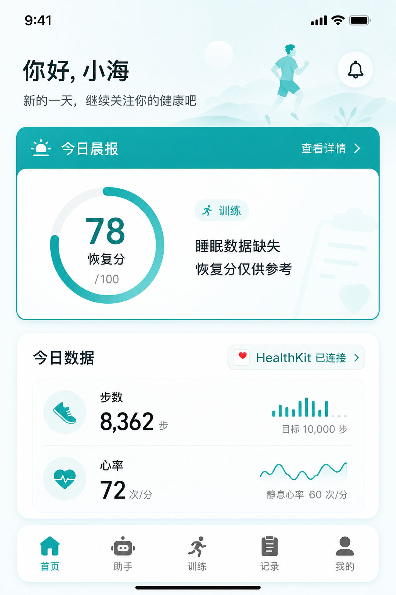

*图4 首页示意（五 Tab）*

首页是每天打开 App 后的主界面。底部有五个主入口：**首页 / 助手 / 训练 / 记录 / 我的**。

### 5.1 顶部区域

- 左侧：头像 + **「你好，」** + 你的昵称  
- 右侧：通常显示 **「今日」**；数据加载或同步中可能显示 **「同步中...」**  

昵称优先级：档案昵称 → 邮箱前缀 → 其他兜底文案。

### 5.2 今日晨报卡片

| 元素 | 说明 |
|------|------|
| 标题 | 「☀️ 今日晨报」 |
| 刷新 | 右上角「刷新」；进行中显示「刷新中」 |
| 正文 | AI 生成的今日建议摘要 |
| 恢复分 | 0–100；颜色大致：偏高偏绿、中等偏橙、偏低偏灰 |
| 训练建议 | 如「训练 / 轻度 / 休息」；可点击进入「训练」Tab 看完整计划 |
| 睡眠提示 | 若无真实睡眠数据，可能出现 **「睡眠数据缺失，恢复分仅供参考」** |

**首次进入**可能短暂显示「生成晨报中...」或「加载中...」。  
生成晨报前会先同步最新 HealthKit（已授权时）。  
若失败，可点错误提示重试，或点「刷新」。

#### 5.2.1 恢复分如何理解（通俗版）

满分约 100，大致由四部分组成：

| 维度 | 大约占比 | 说明 |
|------|----------|------|
| 睡眠 | 40% | 有真实睡眠时按时长与质量计分；**没有真实睡眠**时给中性分（不按 0 分打），并提示仅供参考 |
| 休息平衡 | 30% | 看连续休息天数，也看近 7 天休息节奏（避免「练 7 休 2」在训练日被打成 0） |
| 活动 | 20% | 与步数等相关 |
| 心情 | 10% | 来自你在「记录」里保存的当日心情（很好 / 不错 / 一般 / 疲惫） |

训练建议文案（训练 / 轻度 / 休息）与恢复分联动，仅供生活方式参考。

#### 5.2.2 对建议做反馈（重要）

若尚未反馈过，卡片下方会出现：

- **👍 采纳**  
- **👎 忽略**  
- **✏️ 修改**  

用途：告诉系统这条建议是否适合你，便于后续优化。

**修改流程：**

1. 点击「修改」。  
2. 在输入框填写你想怎么改（例如：「今天想做瑜伽而不是跑步」），最长约 **200** 字。  
3. 点「提交修改」，或「取消」。  

提交成功会提示「感谢反馈」，之后显示「已采纳 / 已忽略 / 已修改」等状态，**同一条通常不可重复提交**。

### 5.3 今日数据卡片

- 标题：**今日数据**  
- **来源徽标**（请留意）：如 `HealthKit`、`部分同步`、`参考数据`、`暂无同步` 等，可能附带质量相关信息  
- 默认一行常用指标：例如 **步数、静息心率、运动次数**  
- 点击 **「更多」** 展开更多指标（睡眠分段、热量、站立、距离等）；再点 **「收起」**  

> 若徽标为「参考数据」或类似含义，表示并非完整真实同步，建议完成 HealthKit 授权并确保「健康」App 中有数据。

### 5.4 关于「刷新太频繁」与「今早还是昨天数据」

为提升流畅度，首页在短时间内重复进入时**可能不会每次都重新拉云端**（约数分钟内可秒开缓存）。同时：

- **跨到新的一天**后，昨日缓存会失效，并优先触发 HealthKit 同步。  
- 若你刚记了运动 / 睡眠 / 心情，或刚在授权页同步，回首页会尽快刷新。  
- 需要立刻重算晨报时，点晨报旁的 **「刷新」**（会先同步手机再生成）。  

若仍感觉数据偏旧：到「我的 → 数据同步」点 **手动刷新**，再回首页点晨报「刷新」。

---

## 六、HOP 助手（文字 + 语音）

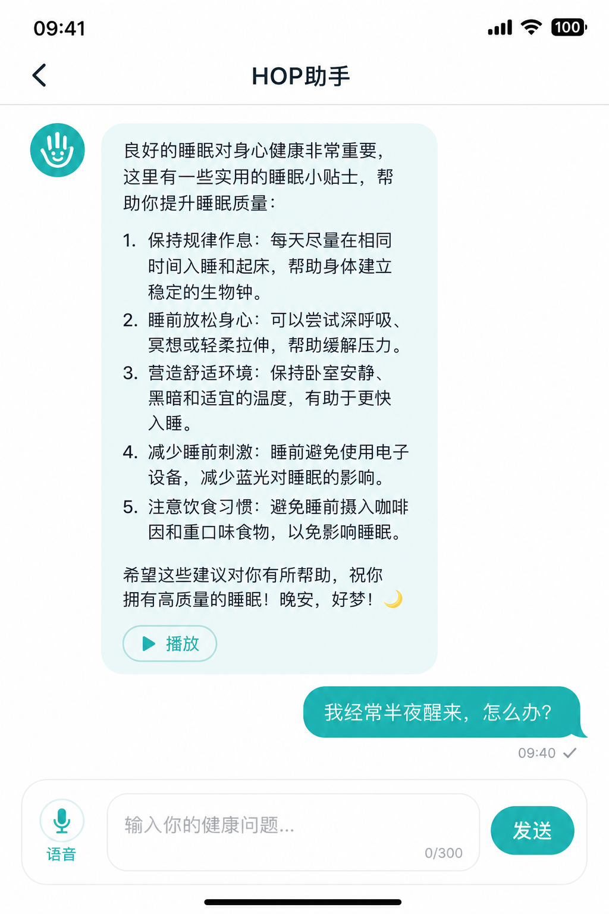

*图5 HOP 助手对话示意*

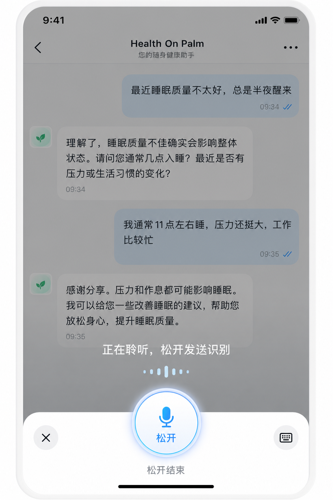

*图6 语音输入（按住说话）示意*

### 6.1 进入与返回

- 底部 Tab 点击 **「助手」** 进入（也可从其他页面切过来）  
- 标题：**HOP 助手**  

首次进入会加载历史；可能显示「加载对话...」。若无历史，会出现欢迎语，大意是：你是 HOP 健康助手，可问运动、睡眠、恢复等问题。

### 6.2 文字提问（完整步骤）

1. 点击底部输入框。  
2. 输入问题，例如：「我最近睡得不好怎么办？」  
3. 注意右下角字数：**最多约 200 字**（显示为 `当前字数/200`）。  
4. 点击 **「发送」**。  
5. 你的气泡出现在右侧；助手思考时左侧可能出现加载动画。  
6. 助手回复出现在左侧气泡。  

发送过程中，输入框与发送按钮可能暂时不可用，请等待回复结束。

### 6.3 语音输入（按住说话）

1. 用手指**按住**左侧 **「语音」** 按钮不放。  
2. 若系统首次询问麦克风权限，请点 **允许**。  
3. 按住期间：  
   - 按钮文案可能变为「松开」  
   - 输入区提示「松开结束」  
   - 可能出现遮罩提示：**「正在聆听，松开发送识别」**  
4. **说完后再松开**（建议至少说满约 **1 秒**；过短会提示「录音太短，请按住多说一两秒」）。  
5. 松开后进入识别，按钮可能显示「...」，提示「识别中...」。  
6. 成功后文字会填入输入框，并提示「已填入文字」。  
7. 请**确认文字是否正确**，必要时手动改几个字，再点「发送」。  

**录音限制：**

| 项目 | 说明 |
|------|------|
| 过短 | 约不足 0.8 秒可能无效 |
| 过长 | 单次最长约 60 秒 |
| 取消 | 手指滑出取消手势区域 / 触发取消时，录音中止且不识别 |
| 失败 | 「无法开始录音，请检查麦克风权限」等 |

> 语音识别依赖网络与云端转写服务；嘈杂环境可能影响准确率。

### 6.4 播放助手回复（朗读）

1. 在助手气泡下方找到 **「播放」**。  
2. 点击后可能短暂显示「生成语音...」。  
3. 开始播报后，按钮变为 **「停止」**；再点可停止。  
4. 同一时间通常只播放一条；切换其他消息播放会停掉当前。  

播报失败时会提示「播报失败」或具体原因，请检查网络后重试。

### 6.5 提问建议（更有用）

可以问：

- 睡眠、恢复、今日是否适合训练  
- 步数偏少时如何温和补活动  
- 结合你刚记录的运动 / 心情提问  

尽量避免：

- 要求确诊某种疾病  
- 要求具体药品名称与剂量  
- 紧急胸痛、呼吸困难等 —— 应立即就医或呼叫急救，而不是问 App  

### 6.6 发送失败时

可能看到 Toast，以及助手气泡中的致歉说明（暂时无法连接 AI 等）。请稍后重试；若持续失败，把时间点与截图发给组织者。

---

## 七、今日训练计划（训练 Tab）

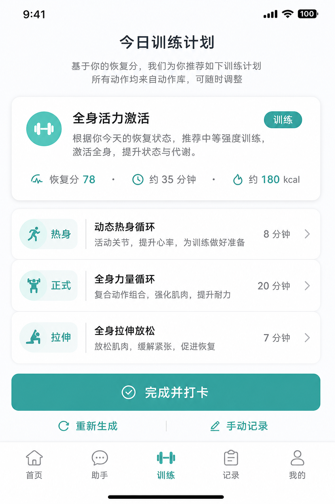

*图7 今日训练计划示意*

底部 Tab 点击 **「训练」**，进入今日计划页。

### 7.1 页面在做什么

- 根据当日**恢复分 / 训练建议**，从精选动作库生成一套可执行计划。  
- 结构通常包含：**热身 → 正式 → 拉伸**。  
- 顶部摘要会显示计划标题、训练强度标签、理由、预估时长与热量等。

### 7.2 日常使用步骤

1. 打开「训练」Tab；首次会显示「正在生成计划…」。  
2. 浏览摘要卡片，确认今日是否适合训练 / 轻度 / 休息。  
3. 点击某一动作行的 **「详情」**，可查看肌群、器械、说明与来源署名；再点 **「收起」**。  
4. 按能力与体感完成动作；**感到不适请立即停止**，不要硬撑。  
5. 完成后点击底部 **「完成并打卡」**，成功提示「已打卡」，并可前往运动历史查看。  

### 7.3 其他操作

| 操作 | 作用 |
|------|------|
| 重新生成 | 强制重新向云端请求一套计划（需联网） |
| 手动记录 | 跳到「记录运动」页，自行补一条训练 |
| 完成并打卡 | 把今日计划记入运动日志（来源标记为 AI 建议） |

> 动作内容来自精选公开动作库，页面底部会有署名 / 许可说明，请一并阅读。

---

## 八、健康记录（运动 / 心情 / 睡眠）

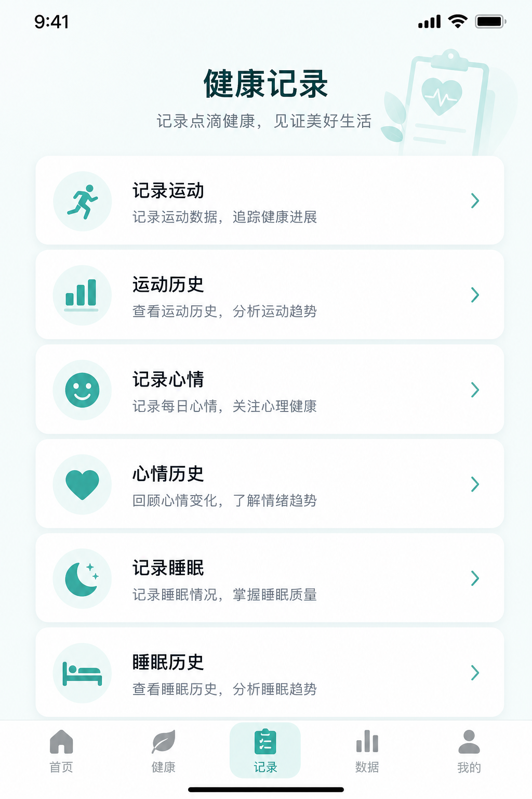

*图8 「记录」Tab 入口示意*

底部 Tab 点击 **「记录」**，进入健康记录枢纽页。页面说明大意：记录运动、心情与睡眠，让 HOP 建议更贴合你的状态。

### 8.1 入口一览

| 入口 | 作用 |
|------|------|
| 记录运动 | 手动补一次训练 |
| 运动历史 | 近 7 天训练列表与周汇总、删除 |
| 记录心情 | 每日一记，参与恢复分心情维度 |
| 心情历史 | 近 7 天心情列表与周汇总、删除 |
| 记录睡眠 | 手动补一晚睡眠 |
| 睡眠历史 | 近 7 天睡眠列表与周汇总、删除（规则见下） |

---

### 8.2 记录运动（逐步）

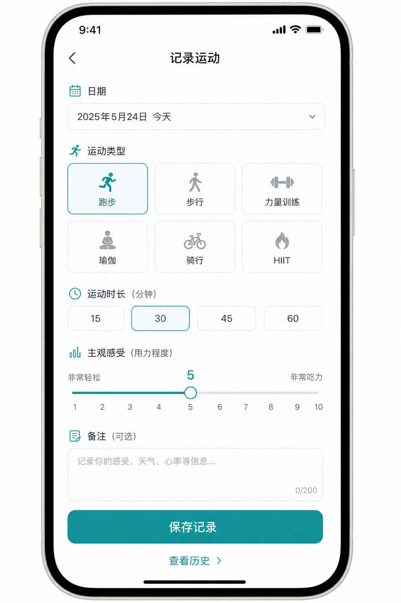

*图9 记录运动页示意*

1. 进入「记录运动」。  
2. **日期**：选择近 7 天内的某一天（含今天/昨天等标签）。  
3. **运动类型**（必选其一，按分类选择），例如：  
   - **有氧 / 户外**：跑步、步行、骑行、徒步、游泳、椭圆机、划船机  
   - **力量 / 柔韧**：力量训练、HIIT、瑜伽/拉伸、普拉提、舞蹈  
   - **球类**：羽毛球、乒乓球、篮球、网球、排球、足球  
   - **其他**  
4. **时长（分钟）**：可点预设（如 15 / 30 / 45 / 60 分），或手动输入；须 **大于 0**（系统校验通常在 1–600 分钟）。  
5. **主观疲劳度**：1–10，有「很轻松 → 精疲力竭」等文案提示。  
6. **备注（可选）**：最多约 200 字。  
7. 点击 **「保存记录」**，成功提示「已保存」，并返回上一页（失败时可能跳到历史页）。  

附加链接：

- **查看历史** → 运动历史  

### 8.3 运动历史

1. 查看近 7 天记录。  
2. 顶部周历：点击某日可筛选当天；再点一次取消筛选看全部。  
3. **本周汇总**：运动次数、总时长、最常类型等。  
4. 每条显示时长、疲劳度、来源（HealthKit / 手动 / AI 建议等）。  
5. 点 **「删除」** → 确认弹窗 → 确认后删除。  
6. 底部 **「添加记录」** 可回到记录页。  

无数据时会提示去记录一次或等待 HealthKit 同步。

---

### 8.4 记录心情（逐步，v1.1 新增）

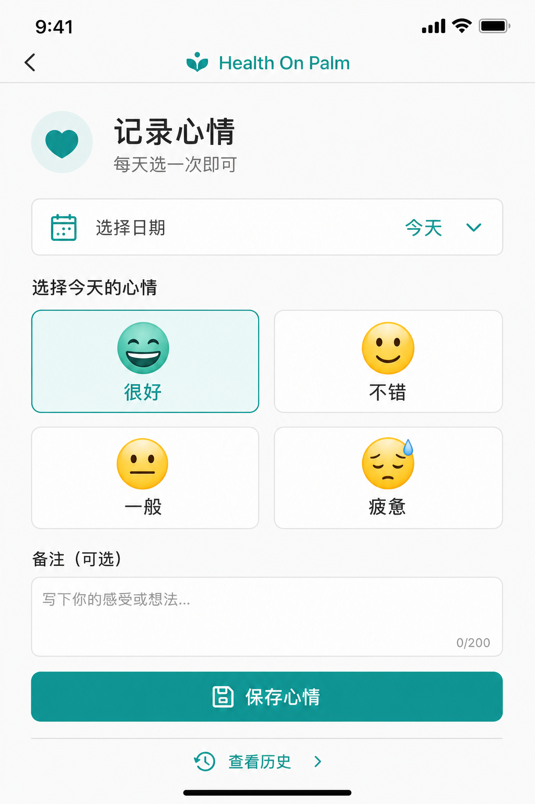

*图10 记录心情页示意*

1. 进入「记录心情」。  
2. **日期**：选择近 7 天中的某一天（通常每天记一次即可）。  
3. **今天感觉如何**（必选）：  
   - 很好 · 不错 · 一般 · 疲惫（页面会提示各自大约对应的恢复分贡献）  
4. **备注（可选）**：最多约 200 字。  
5. 可在同页查看 **近 7 天** 已记心情摘要。  
6. 点击 **「保存心情」**。  

保存后，当日晨报 / 恢复分在下次刷新时会纳入心情维度。也可点 **「查看历史」** 进入心情历史页管理。

### 8.5 心情历史

与运动历史类似：近 7 天列表、周汇总、可删除手动记录。删除后首页缓存会失效，回首页会重新拉取。

---

### 8.6 记录睡眠（逐步）

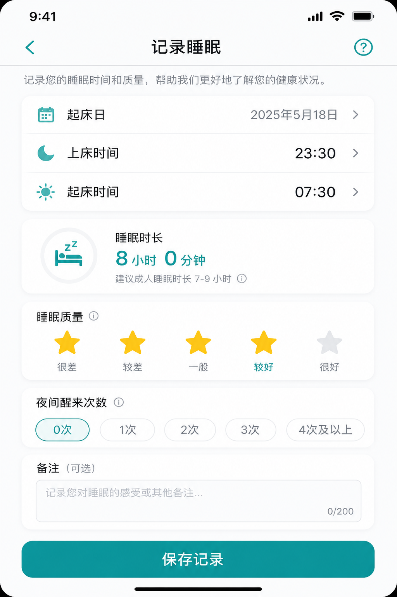

*图11 记录睡眠页示意*

1. 进入「记录睡眠」。  
2. **日期（起床日）**：选择近 7 天中的起床日（以页面可选日期为准）。  
3. **就寝时间**、**起床时间**：用时间选择器设置。  
4. 页面会自动计算 **睡眠时长**（无效组合时可能显示 `--`）。  
5. **睡眠质量**：点亮 1–5 星。  
6. **夜间醒来次数**：0–20，可用快捷「0 次…5 次」或输入。  
7. 点击 **「保存记录」**。  

**默认可参考：** 就寝 23:00、起床 07:00、质量 3 星、醒来 0 次（以页面实际默认为准）。

**可保存条件：** 能算出有效时长，且质量至少 1 星；时长通常需落在约 1–16 小时。

> 若当日已有 HealthKit 睡眠，手动补录可能会被提示「当日已有 HealthKit 睡眠数据，无需手动补充」。

### 8.7 睡眠历史

与运动历史类似：近 7 天、周筛选、周汇总（平均时长、平均质量、趋势文案）。

**重要差异：**

- 来源显示：如 `HealthKit` / `手动`  
- **来自 HealthKit 的记录通常不能在此删除**；仅手动类记录显示「删除」  

---

## 九、我的档案与设置

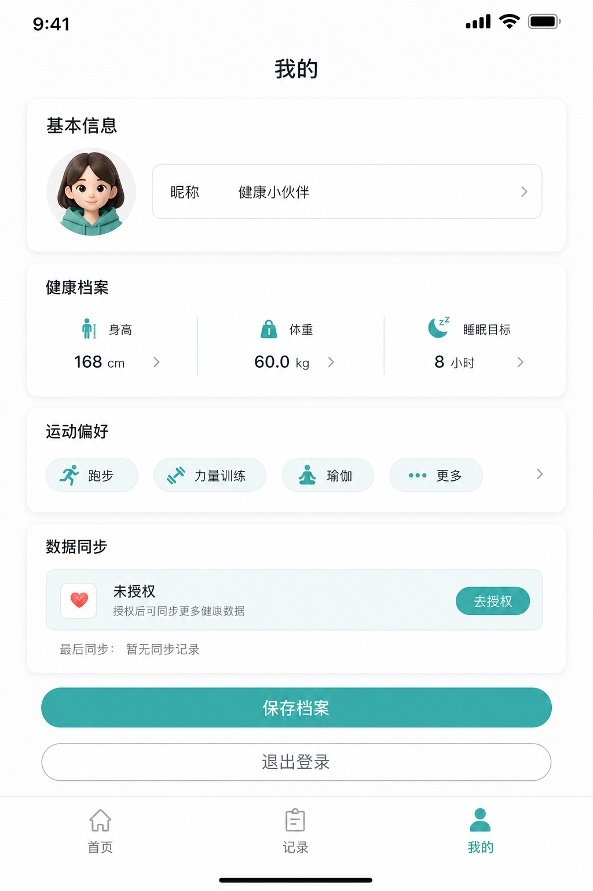

*图12 「我的」档案页示意*

底部 Tab 点击 **「我的」**。

### 9.1 基本信息

| 项 | 说明 |
|----|------|
| 头像 | 点击会提示「头像上传功能即将开放」（当前占位） |
| 昵称 | 必填，最长约 20 字 |
| 年龄 | 18–80 |
| 性别 | 男 / 女 / 其他 |

### 9.2 健康档案

- 身高、体重（范围同引导页）  
- 职业（可选，约 30 字内）  
- **睡眠目标**：约 6–9 小时，可滑动调节  

### 9.3 运动偏好

- 运动水平、偏好训练时间（同引导）  
- **偏好训练时长**：约 15–60 分钟，步进调节  

### 9.4 数据同步

- 展示是否已授权 HealthKit、最近同步时间（今天会显示「今天 HH:MM」，跨日会显示具体日期）  
- 点击整块进入 **健康数据授权** 页（`from=profile`）  
- 非 iOS 环境会提示不支持 HealthKit  

若提示「需要自定义调试基座」，说明当前安装包未包含原生 HealthKit 插件——种子用户请使用组织者提供的 **TestFlight 正式构建**，不要用错误的旧包。

### 9.5 保存档案

1. 检查必填项。  
2. 点击 **「保存档案」**。  
3. 成功提示「保存成功」，并返回首页。  

### 9.6 退出登录

1. 点击 **「退出登录」**。  
2. App 清除本地会话与首页缓存，回到登录页。  
3. 再次使用需重新登录（邮箱+密码）。  

---

## 十、底部导航总览

| Tab | 名称 | 功能 |
|-----|------|------|
| 1 | 首页 | 晨报、恢复分、今日数据、自动同步入口体验 |
| 2 | 助手 | 文字 / 语音健康问答与朗读 |
| 3 | 训练 | 今日训练计划、重新生成、完成打卡 |
| 4 | 记录 | 运动 / 心情 / 睡眠录入与历史 |
| 5 | 我的 | 档案、同步入口、退出 |

切换 Tab 会跳到对应主页面；从子页面（如历史）可用系统返回或页面内链接回到上级。

---

## 十一、完整「理想首日」路径（建议照做一遍）

用时约 25–35 分钟：

1. TestFlight 安装并打开 App  
2. **注册**邮箱账号并登录  
3. 走完**新手引导**  
4. **授权 HealthKit** 并确认同步成功  
5. 在**首页**阅读晨报；若有睡眠缺失提示，可到「记录」补睡眠或心情后再点「刷新」  
6. 点一次「采纳 / 忽略 / 修改」反馈  
7. 打开 **助手**，文字问一个睡眠/恢复问题  
8. （可选）**按住语音**说一句话并发送  
9. （可选）对助手回复点 **播放**  
10. 打开 **训练**，浏览计划，可「完成并打卡」或「手动记录」  
11. 在「记录」里**补一条心情**（或运动 / 睡眠）  
12. 打开「我的」确认档案与最近同步时间  

完成以上，即覆盖本说明书几乎全部核心功能。

---

## 十二、权限、隐私与安全提示

1. **麦克风**：仅语音输入需要；可随时在系统设置中关闭。  
2. **健康数据**：请在系统「健康」中管理 App 可访问类别。  
3. **账号**：请使用本人邮箱；勿分享密码。  
4. **内容边界**：HOP 不做诊断、不开药、不给具体用药剂量；训练动作请量力而行，不适即停。  
5. **内测阶段**：功能与文案可能变化；遇到 Bug 请截图 + 说明操作步骤发给组织者。  

---

## 十三、常见问题（FAQ）

### Q1：注册成功但进不去？

检查网络；确认组织者已关闭邮箱确认（Confirm email）；尝试杀掉 App 重开；仍不行把邮箱域名与报错原文发给组织者。

### Q2：首页一直是参考数据？

完成 HealthKit 授权；打开手机「健康」确认有步数/睡眠；在授权页点「再次同步」；回首页稍等自动同步，或点晨报「刷新」。

### Q3：今早打开还是昨天的数据？

确认已升级到含自动同步的版本；打开首页等待「同步中」结束；到「我的 → 数据同步」看最近同步是否显示「今天」；必要时手动刷新后再刷新晨报。

### Q4：语音没反应？

检查麦克风权限；按住时间是否过短；是否有网络；是否在说话时一直按住直到说完。

### Q5：播放没有声音？

检查静音键 / 音量；网络是否正常；换一条较短回复再试。

### Q6：运动 / 心情保存了，首页没变？

稍等再进首页，或点晨报「刷新」；历史页应能立刻看到新记录。心情会影响恢复分，通常需刷新晨报后更明显。

### Q7：为什么删不掉某条睡眠？

HealthKit 同步来的睡眠记录通常不允许在 App 内删除，避免与系统健康数据冲突。

### Q8：可以在安卓用吗？

当前主路径为 **iPhone + HealthKit**，Android 不在本阶段支持范围。

### Q9：聊天内容会保存吗？

会加载历史对话以便连续交流；请勿在对话中粘贴他人敏感病历或证件信息。

### Q10：训练计划里的动作必须全做吗？

不必。计划仅供参考；请按自身能力调整，不适即停。可用「手动记录」登记你实际完成的内容。

---

## 十四、附录：输入与业务约束速查

| 项目 | 约束 |
|------|------|
| 邮箱 | 基础格式校验，≤254 |
| 密码 | ≥6 |
| 昵称 | ≤20 |
| 年龄 | 18–80 |
| 身高 | 100–250 cm |
| 体重 | 30–200 kg |
| 晨报修改备注 / 运动备注 / 心情备注 / 聊天输入 | ≤200 字 |
| 运动时长 | >0；通常 1–600 分钟 |
| 疲劳度 | 1–10 |
| 睡眠时长 | 约 1–16 小时 |
| 睡眠质量 | 1–5 星 |
| 夜间醒来 | 0–20 次 |
| 心情选项 | 很好 / 不错 / 一般 / 疲惫 |
| 语音最短 / 最长 | 约 ≥0.8 秒 / ≤60 秒 |
| 历史窗口 | 运动、心情、睡眠均为近 7 天 |
| HealthKit 自动同步 | 约每 30 分钟，或跨日；晨报生成前强制同步 |

---

## 十五、反馈与支持

- 内测说明：`doc/种子用户内测说明_v0.1.md`  
- 反馈追踪表：`doc/种子用户反馈追踪表_v0.1.md`  
- 反馈时请尽量提供：机型、iOS 版本、账号邮箱（可打码）、操作步骤、截图、大概时间  

---

## 修订记录

| 版本 | 日期 | 说明 |
|------|------|------|
| v1.0 | 2026-08-08 | 首版完整使用说明书；含界面示意图与全流程操作说明 |
| v1.1 | 2026-08-20 | 五 Tab；训练计划；心情记录；运动类型扩展；HealthKit 半小时/跨日自动同步与晨报前同步；恢复分与跨日缓存说明更新 |

---

**感谢体验 Health On Palm。**  
愿你每天都更了解自己的身体节奏——也请记住：稳健的生活习惯 + 必要的医疗专业意见，永远比任何 App 更重要。
